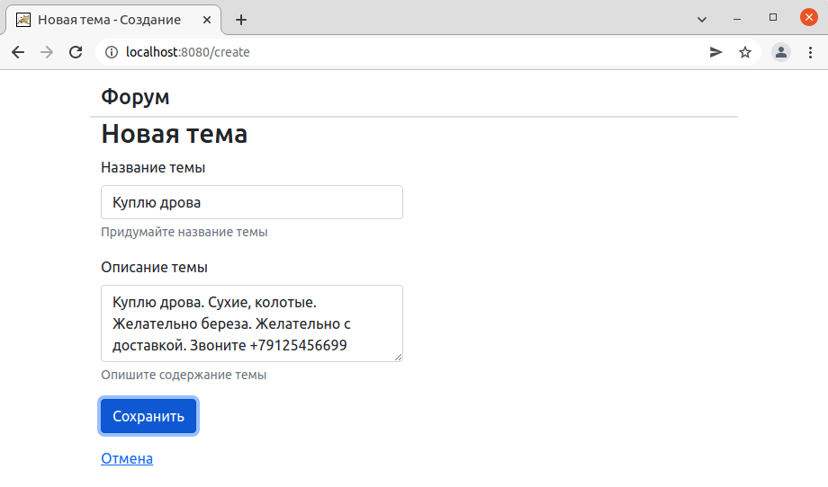

# Приложение Forum

## О проекте. 
#### Описание
Веб приложение, реализующее функционал закрытого интернет форума.
Позволяет создавать темы для обсуждения, и оставлять комментарии.
Темы и обсуждения могут просматривать только зарегистрированные пользователи. 

#### Технологии
>JDK14, Maven, Spring Boot, PostgreSQL, Liquibase

## Сборка
0. Скачать файлы репозитория
1. Произвести сборку проекта: `mvn clean install`
2. Скопировать полученный файл "forum-1.war" из папки target в папку вашего сервера
3. Приложение будет доступно по адресу: http://localhost:8080

## Запуск через Docker Compose
1. Создать директорию на сервере и скопировать файлы репозитория
2. Перейти в созданную директорию (корень проекта) и собрать приложение командой: `mvn clean install`
3. Собирать docker-образ приложения командой: `docker build -t forum .`
4. При необходимости отредактировать порты, используемые приложением в файле docker-compose.yml
5. Запустить приложение командой: `docker-compose up`

## Запуск в кластере K8s
Файлы конфигурации *.yml находятся в корне проекта, в директории k8s
1. Создаем Secret: `kubectl apply -f postgresdb-secret.yml`
2. Создаем ConfigMap: `kubectl apply -f postgresdb-configmap.yml`
3. Создаем Deployment для БД: `kubectl apply -f postgresdb-deployment.yml`
4. Создаем Deployment для Spring Boot: `kubectl apply -f spring-deployment.yml`

## Как пользоваться
При старте приложения необходимо ввести логин и пароль или зарегистрироваться.

После регистрации пользователь попадает на главную страницу со списком 
всех существующих тем для обсуждения. Для перехода в обсуждение необходимо кликнуть
по названию темы.

В обсуждении можно узнать подробную информацию по теме, а также оставить свои комментарии.

Также пользователь может создавать собственные темы для обсуждения и редактировать их.

## Контакты
Кутявин Владимир

skype: tribuna87

email: tribuna87@mail.ru

telegram: @kutiavinvladimir